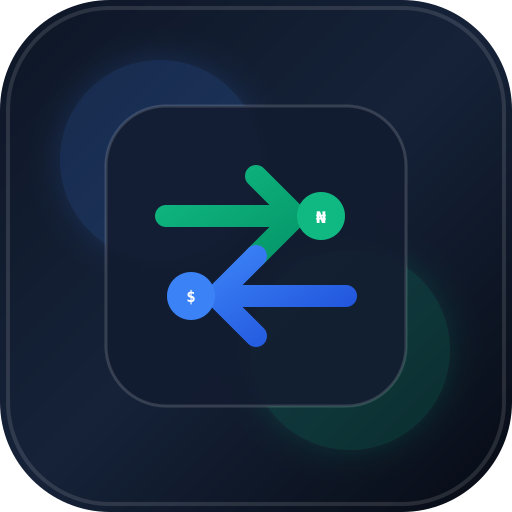

# Bybit NGN P2P Trade Tracker — PWA

A modern, offline-capable Progressive Web App (PWA) designed to record, analyze, and manage all your Bybit USDT/NGN P2P trades with a **FIFO (First-In, First-Out) Cost-Basis Inventory & Realized P&L Engine**.



---

## 🚀 Key Features

* **FIFO Cost-Basis Profit Engine**: Accurately calculates Realized Profit & Loss (P&L) when BUY and SELL quantities differ. Tracks matched inventory lots and alerts on external/unrecorded quantities.
* **Real-time Analytics Dashboard**:
  * Net Realized P&L with ROI (%) and dynamic color coding (Emerald/Rose).
  * Current USDT Inventory in stock with average acquisition cost per token.
  * Total Invested (Buys) and Total Realized (Sells).
  * Cumulative Realized P&L Area Chart (Chart.js) with 7D, 30D, and All-Time filters.
  * Recent activity feed with 1-tap edit.
* **Trade Entry & Multi-Row Fees**:
  * Segmented BUY / SELL direction toggle.
  * Reactive two-way calculations (Rate × USDT = NGN & NGN / Rate = USDT).
  * Dynamic fee manager (Bank Transfer, Bybit Fee, Network Gas, SMS Alert, Custom).
  * Summary cards displaying effective exchange rate and net cost/revenue.
* **Searchable & Filterable Trade History**:
  * Full-text search across counterparty nickname, bank, notes, or numbers.
  * Filters for Trade Type (`Buy`/`Sell`/`All`) and Bank Account.
  * Sort by Newest, Oldest, Highest/Lowest Amount, and Highest/Lowest Profit.
  * Collapsible drawers for itemized FIFO matched buy lots and fee breakdowns.
* **Bank Account & Transfer Management**:
  * Multiple bank accounts with auto-sync into trade form dropdowns.
  * Internal wallet transfer tracking (Funding, Unified Trading, Spot, External).
* **Opening Inventory Support**:
  * Set starting USDT balance and acquisition cost basis in Settings.
* **Data Portability**:
  * 1-Click CSV export for Excel / Google Sheets.
  * Full JSON database backup and restore.
* **Progressive Web App (PWA)**:
  * 100% offline ready via Service Worker caching.
  * Installable as a standalone app on iOS, Android, and Desktop.

---

## 📁 Architecture & File Structure

```
├── index.html            # Lightweight SPA shell
├── manifest.json         # PWA Manifest (standalone display)
├── sw.js                 # Offline caching service worker
├── css/
│   └── styles.css        # Slate/Navy glassmorphism design system
├── icons/
│   ├── icon.svg          # Vector emblem
│   ├── icon-192.png      # 192×192 icon
│   └── icon-512.png      # 512×512 icon
└── js/
    ├── app.js            # App bootstrap & view coordinator
    ├── utils.js          # Pure formatting, math, date, & FIFO engine
    ├── store.js          # LocalStorage CRUD & migration engine
    ├── banks.js          # Bank accounts controller & dropdown sync
    ├── fees.js           # Dynamic fee rows manager
    ├── trades.js         # Trade form controller & calculations
    ├── transfers.js      # Wallet transfers controller
    ├── dashboard.js      # Dashboard metrics & Chart.js renderer
    ├── history.js        # Search, multi-factor filters & trade cards
    ├── export.js         # CSV export, JSON backup & restore engine
    ├── settings.js       # Settings controller & opening inventory
    └── views/
        ├── dashboard.view.js   # Dashboard template
        ├── addTrade.view.js    # Trade form template
        ├── history.view.js     # Trade history template
        ├── settings.view.js    # Settings template
        └── modals.view.js      # Bank & Transfer modals template
```

---

## 💻 Getting Started

You can run this app locally using any static web server:

```bash
# Using Node / npx serve
npx serve .

# Or using Python 3
python -m http.server 8000
```

Open `http://localhost:8000` (or `http://localhost:3000`) in your browser or install it directly to your home screen!

---

## 📄 License
MIT License.
